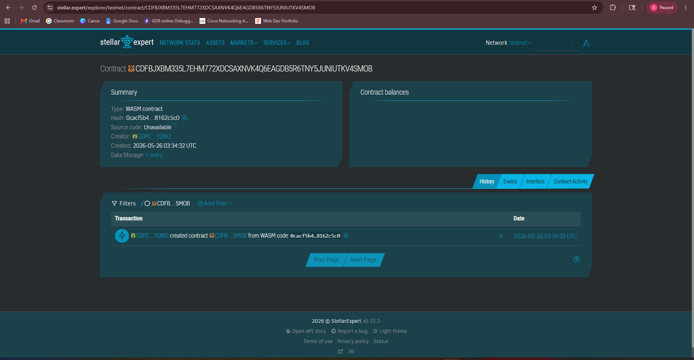

# 🚢 Freight Rental Agreement System (Soroban)

A blockchain-based system for securely recording freight rental agreements.

---

## 📌 Problem
Freight agreements are often paper-based or editable, leading to disputes, tampering, and lack of transparency.

## ✅ Solution
This smart contract stores agreements immutably on-chain, ensuring:
- Permanent records
- Tamper-proof data
- Transparent verification

---

## ⏳ Timeline
- Week 1: Design & planning
- Week 2: Smart contract development
- Week 3: Testing & debugging

---

## ⭐ Stellar Features Used
- Soroban Smart Contracts
- On-chain storage
- Ledger timestamping

---

## 🎯 Vision and Purpose
To improve trust and transparency in logistics and shipping transactions.

---

## ⚙️ Prerequisites
- Rust installed
- Soroban CLI (latest)

---

## 🛠️ Build
Contract CD23DMTRXG7C5GGU4PCWWXICOURJ26FBUEW7ZUYTPFVF6BWNQVHQQXAJ
https://stellar.expert/explorer/testnet/contract/CD23DMTRXG7C5GGU4PCWWXICOURJ26FBUEW7ZUYTPFVF6BWNQVHQQXAJ

